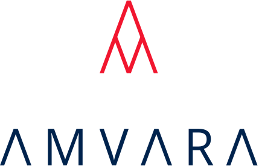

  

# Amvara Community

[![Discord][discord-badge]][discord-invite-url]

A amvara-ran Discord for all things Amvara Consulting.

# Discord Rules

1. Follow the Code of Conduct.

2. Do not spam users or channels. Be patient. Unsolicited direct messages (DMs) are not allowed. Keep messages relevant to the channel they're in. Do not send the same message to different channels.

3. Be civil and professional. Personal attacks, harassment, and hate speech will not be tolerated.

4. Safe for work content only. Pornographic, sexual innuendo, and extremist content is strictly forbidden.

5. Clean language only. Inappropriate and offensive language is strictly forbidden.

7. Follow the Discord Terms of Service. https://discord.com/terms

8. @Staff and @Moderator always have the final decision. Use a direct message if you would like clarification.

<!--
References
-->

[discord-tos]: https://discord.com/terms
[discord-invite-url]: https://discord.gg/VeMbxJWxsg
[discord-badge]: https://img.shields.io/discord/810822044367061042?color=7289DA&label=Discord&logo=discord&logoColor=ffffff&style=flat-square
